# FastAPI Architecture Diagram

```mermaid
graph TD
    Client["HTTP/WebSocket Client"]

    subgraph ASGI["ASGI Application Layer"]
        FastAPI["FastAPI\nextends Starlette"]
    end

    subgraph Middleware["Middleware Stack (outermost → innermost)"]
        M1["ServerErrorMiddleware\n(Starlette)"]
        M2["User Middleware\n(CORS, GZip, TrustedHost, HTTPS, WSGI)"]
        M3["ExceptionMiddleware\n(Starlette)"]
        M4["AsyncExitStackMiddleware\n(resource cleanup)"]
    end

    subgraph Routing["Routing Layer"]
        APIRouter["APIRouter\nextends starlette Router"]
        APIRoute["APIRoute\nextends starlette Route\n(HTTP)"]
        WSRoute["APIWebSocketRoute\nextends starlette WebSocketRoute"]
    end

    subgraph DI["Dependency Injection System"]
        Dependant["Dependant\n(parsed fn signature)"]
        SolveDeps["solve_dependencies()\nresolves full dep tree"]
        Depends["Depends / Security\n(dependency markers)"]
        Params["Param Annotations\nPath · Query · Header\nCookie · Body · Form · File"]
    end

    subgraph RequestHandling["Request Handling"]
        ReqHandler["get_request_handler()\nrequest_response() wrapper"]
        BodyParse["Body Parsing\nJSON · Form · Multipart"]
        RunEndpoint["run_endpoint_function()\n(sync or async)"]
        Serialize["serialize_response()\nPydantic validation"]
    end

    subgraph Responses["Response Classes"]
        JSONResp["JSONResponse (default)"]
        StreamResp["StreamingResponse"]
        SSEResp["EventSourceResponse (SSE)"]
        HTMLResp["HTMLResponse"]
        FileResp["FileResponse"]
        RedirResp["RedirectResponse"]
    end

    subgraph OpenAPI["OpenAPI / Docs Generation"]
        GetOpenAPI["get_openapi()"]
        OpenAPISchema["/openapi.json endpoint"]
        SwaggerUI["/docs — Swagger UI"]
        ReDoc["/redoc — ReDoc"]
        OpenAPIModels["OpenAPI Pydantic models"]
    end

    subgraph Security["Security Schemes"]
        OAuth2["OAuth2 / PasswordBearer\nAuthorizationCodeBearer"]
        APIKey["APIKeyQuery\nAPIKeyHeader · APIKeyCookie"]
        HTTPAuth["HTTPBasic · HTTPBearer\nHTTPDigest"]
        OIDC["OpenIdConnect"]
    end

    subgraph Validation["Data Validation (Pydantic v2)"]
        Pydantic["Pydantic BaseModel\ntype annotations"]
        FieldInfo["FieldInfo / ModelField"]
    end

    subgraph BackgroundTasks["Background Tasks"]
        BGTasks["BackgroundTasks\n(post-response execution)"]
    end

    subgraph Starlette["Starlette Foundation"]
        StarletteApp["starlette.applications.Starlette"]
        StarletteRouter["starlette.routing.Router"]
        StarletteReq["starlette.requests.Request"]
        StarletteResp["starlette.responses.*"]
        StarletteWS["starlette.websockets.WebSocket"]
        StarletteBG["starlette.background.BackgroundTasks"]
    end

    %% Client → ASGI
    Client -->|HTTP request| FastAPI
    Client -->|WebSocket| FastAPI

    %% FastAPI → Middleware → Routing
    FastAPI --> M1 --> M2 --> M3 --> M4 --> APIRouter
    FastAPI -->|owns| APIRouter
    FastAPI -->|generates| OpenAPISchema
    FastAPI -->|generates| SwaggerUI
    FastAPI -->|generates| ReDoc

    %% Routing
    APIRouter -->|owns| APIRoute
    APIRouter -->|owns| WSRoute

    %% Route → Handler
    APIRoute -->|builds| ReqHandler
    WSRoute -->|builds| ReqHandler

    %% Handler pipeline
    ReqHandler --> BodyParse
    BodyParse --> SolveDeps
    SolveDeps -->|uses| Dependant
    SolveDeps -->|resolves| Params
    SolveDeps -->|resolves| Depends
    SolveDeps --> RunEndpoint
    RunEndpoint --> Serialize
    Serialize -->|constructs| JSONResp
    Serialize -->|or constructs| StreamResp
    Serialize -->|or constructs| SSEResp
    Serialize -->|or constructs| HTMLResp
    Serialize -->|or constructs| FileResp
    Serialize -->|or constructs| RedirResp
    RunEndpoint -->|schedules| BGTasks

    %% OpenAPI generation
    GetOpenAPI -->|reads routes from| APIRouter
    GetOpenAPI -->|uses| OpenAPIModels
    OpenAPISchema -->|calls| GetOpenAPI
    SwaggerUI -->|links to| OpenAPISchema
    ReDoc -->|links to| OpenAPISchema

    %% Security → DI
    OAuth2 -->|injected via| Depends
    APIKey -->|injected via| Depends
    HTTPAuth -->|injected via| Depends
    OIDC -->|injected via| Depends

    %% Pydantic validation
    Params -->|backed by| FieldInfo
    Dependant -->|validates via| Pydantic
    Serialize -->|validates via| Pydantic

    %% Starlette inheritance
    FastAPI -.->|extends| StarletteApp
    APIRouter -.->|extends| StarletteRouter
    APIRoute -.->|path params from| StarletteReq
    WSRoute -.->|wraps| StarletteWS
    JSONResp -.->|extends| StarletteResp
    BGTasks -.->|extends| StarletteBG

    %% Response → Client
    JSONResp -->|HTTP response| Client
    StreamResp -->|HTTP response| Client
    SSEResp -->|SSE stream| Client
    StarletteWS -->|WS messages| Client
```

## Component Descriptions

| Component | Role |
|-----------|------|
| **FastAPI** | Central ASGI app; owns the router, middleware stack, exception handlers, and OpenAPI metadata |
| **APIRouter** | Collects `APIRoute` and `APIWebSocketRoute` instances; supports prefix, tags, dependencies, and nested inclusion |
| **APIRoute** | Wraps an HTTP handler function; parses its signature into a `Dependant`, generates the ASGI handler |
| **APIWebSocketRoute** | Wraps a WebSocket handler; supports full dependency injection |
| **Middleware Stack** | Layered ASGI wrappers — `ServerErrorMiddleware → User Middleware → ExceptionMiddleware → AsyncExitStackMiddleware` |
| **Dependant** | Internal model representing a parsed endpoint/dependency function: categorised params + nested deps |
| **solve_dependencies()** | Recursively resolves the full dependency tree, validates all params, calls sub-dependencies |
| **Params** | Typed annotation markers — `Path`, `Query`, `Header`, `Cookie`, `Body`, `Form`, `File` |
| **Depends / Security** | Markers for injected callable dependencies; `Security` adds OAuth2 scope support |
| **get_request_handler()** | Builds the `request_response()` ASGI callable that drives the full request pipeline |
| **serialize_response()** | Validates endpoint output against `response_model` via Pydantic; filters fields |
| **BackgroundTasks** | Collects tasks to run after the response is delivered |
| **get_openapi()** | Inspects all routes and builds the OpenAPI 3.x schema dict |
| **Security schemes** | `OAuth2*`, `APIKey*`, `HTTP*`, `OpenIdConnect` — used as dependencies; auto-documented in OpenAPI |
| **Pydantic v2** | Powers all data validation, serialisation, and schema generation |
| **Starlette** | ASGI foundation: request/response primitives, routing base, WebSocket, middleware base |
