# OpenMetadata Architecture Diagram

```mermaid
graph TB
    subgraph UI["UI Layer (React + TypeScript + Vite)"]
        WebUI["openmetadata-ui\nReact SPA\nAnt Design + MUI"]
        CoreComponents["openmetadata-ui-core-components\nShared React Components"]
    end

    subgraph API["API Layer (Dropwizard 5 / Jetty 12 / Java 21)"]
        APIServer["openmetadata-service\nOpenMetadataApplication\nPort 8585 / 8586 (admin)"]
        Resources["REST Resources (53+)\n/api/v1/tables\n/api/v1/databases\n/api/v1/lineage\n/api/v1/pipelines\n..."]
        Auth["Auth & Security\nJWT / OIDC / SAML / LDAP\nRole-Based Access Control"]
        Events["Event System\nChange Events\nWebSocket + Kafka"]
        Search["Search Layer\nElasticsearch / OpenSearch\nFull-text + Faceted"]
        Governance["Governance Engine\nPolicies / Rules\nWorkflows / Automation"]
    end

    subgraph MetadataStore["Metadata Store"]
        JDBI3["JDBI3 Repository Layer\n109 Repository Classes\nCollectionDAO"]
        MySQL["MySQL / PostgreSQL\n40+ Entity Tables\nJSON Document Store"]
        ESIndex["Elasticsearch Index\nSearch Index\nEntity Search"]
    end

    subgraph Spec["Specification Layer"]
        JSONSchema["openmetadata-spec\nJSON Schemas\n26+ Entity Types\n50+ Service Connections"]
        SDK_Java["openmetadata-sdk\nJava SDK\nFluent API"]
    end

    subgraph Ingestion["Ingestion Framework (Python)"]
        WorkflowEngine["Workflow Engine\ntopology_runner.py\nSource → Processor → Sink"]
        Connectors["Source Connectors (50+)\nDatabases / Dashboards\nPipelines / ML / Messaging"]
        Snowflake["Snowflake Connector\nmetadata.py\nlineage.py / usage.py\nquery_parser.py"]
        DBT["dbt Connector\nmetadata.py\ndbt_service.py\ndbt_utils.py"]
        OtherDB["Other Databases\nBigQuery / Postgres\nMySQL / Oracle / Redshift\n..."]
        Sinks["Sinks\nMetadata Server Sink\nElasticsearch Sink"]
        OMeta["ometa/ Python Client\nAPI Mixins"]
    end

    subgraph Orchestration["Orchestration"]
        Airflow["Apache Airflow\nopenmetadata-airflow-apis\nREST Plugin\nDAG Management"]
        K8s["Kubernetes Operator\nopenmetadata-k8s-operator\nCRD-based Deployment"]
    end

    subgraph External["External Data Sources"]
        SFConn["Snowflake"]
        DBTConn["dbt Core / Cloud"]
        PGConn["Postgres / MySQL"]
        DashConn["Tableau / Looker\nSuperset / Metabase"]
        KafkaConn["Kafka / Pulsar"]
        S3Conn["S3 / GCS / ADLS"]
    end

    %% UI → API
    WebUI --> APIServer
    CoreComponents --> WebUI

    %% API internals
    APIServer --> Resources
    APIServer --> Auth
    APIServer --> Events
    Resources --> JDBI3
    Resources --> Search

    %% Metadata Store
    JDBI3 --> MySQL
    Search --> ESIndex

    %% Spec → Service + Ingestion
    JSONSchema --> APIServer
    JSONSchema --> WorkflowEngine
    SDK_Java --> APIServer

    %% Ingestion internals
    WorkflowEngine --> Connectors
    Connectors --> Snowflake
    Connectors --> DBT
    Connectors --> OtherDB
    WorkflowEngine --> Sinks
    Sinks --> OMeta
    OMeta --> APIServer

    %% External → Connectors
    SFConn --> Snowflake
    DBTConn --> DBT
    PGConn --> OtherDB
    DashConn --> Connectors
    KafkaConn --> Connectors
    S3Conn --> Connectors

    %% Orchestration → Ingestion
    Airflow --> WorkflowEngine
    K8s --> APIServer

    %% Governance
    Governance --> Events
    Events --> Governance

    classDef uiStyle fill:#4A90D9,stroke:#2C5F8A,color:#fff
    classDef apiStyle fill:#5BA85A,stroke:#3D7A3C,color:#fff
    classDef storeStyle fill:#E8A838,stroke:#C07A20,color:#fff
    classDef ingestStyle fill:#9B59B6,stroke:#7D3C98,color:#fff
    classDef orchStyle fill:#E74C3C,stroke:#C0392B,color:#fff
    classDef extStyle fill:#95A5A6,stroke:#7F8C8D,color:#fff
    classDef specStyle fill:#1ABC9C,stroke:#148F77,color:#fff

    class WebUI,CoreComponents uiStyle
    class APIServer,Resources,Auth,Events,Search,Governance apiStyle
    class JDBI3,MySQL,ESIndex storeStyle
    class WorkflowEngine,Connectors,Snowflake,DBT,OtherDB,Sinks,OMeta ingestStyle
    class Airflow,K8s orchStyle
    class SFConn,DBTConn,PGConn,DashConn,KafkaConn,S3Conn extStyle
    class JSONSchema,SDK_Java specStyle
```

## Component Legend

| Color | Layer |
|-------|-------|
| Blue | UI Layer |
| Green | API / Service Layer |
| Orange | Metadata Store |
| Purple | Ingestion Framework |
| Red | Orchestration |
| Gray | External Sources |
| Teal | Specification / SDK |
